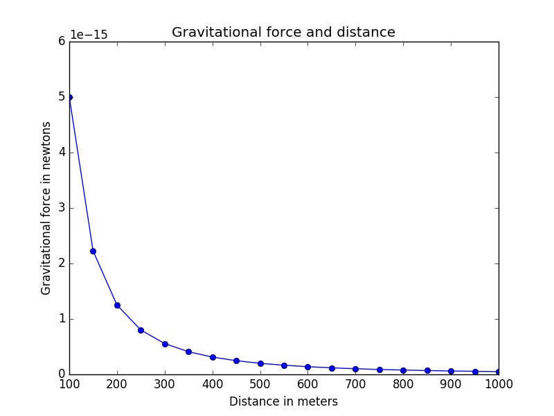

# Graphical representation of Gravational-force-in-newtons-and-distance

Distance in meters 
Gravitational force in newtons
Gravitational force and distance


## Getting Started

These instructions will get idea of the project up and running on your local machine for development and Execution purposes. See deployment for notes on how to deploy the project on a live system.

### Prerequisites

What things you need to install the software and how to install them
```
Python2/Python3
```
* [matplotlib](https://pypi.python.org/pypi/matplotlib) - The Web site matplotlib


### Installing

A step by step have to get a development env running
```
step 1. python2 or python3
step 2. pip install matplotlib

```

## Running the Script

Enter terminal or console windows/Linux/mac.  

Like : python filename.py       

```
Example : python GravitationalForceNW.py
```
## output


## Authors

* **Niranjan Kumar G S** - *Complete work* - [Guithub](https://github.com/niranjangs4)
* **Email : niranjan4@outlook.in**


